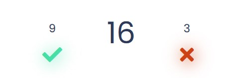

# Quizlet


# Introduction
Quizlet is an interactive quiz which tests users knowledge if the three Frontend Development languages. HTML, CSS and Javascript. Quiz challenges users to beat their high scores by answering each question correctly before time runs out.

# UX
## Scope
The main purpose of this site is to help users establish where the gaps in their knowledge are, in terms of frontend fundamentals. By giving the users an option of saving their score it may entice users to return to the site to better their previous score.

## Site Demographic
- Beginners in HTML, CSS and JavaScript
- Self taught programmers
- Programmers who want to test their knowledge of these languages
- People who want to solidify the knowledge that they already have

# User Stories
## User Goals
|   |   |
|---|---|
|1.| As a user I want to easily navigate throught the site.|
|2.| As a user I want to know how the quiz works before I start playing.|
|3.| As a user I want to know how many questions I got right or wrong.|
|4.| As a user I want to be able to tell how many questions are left.|
|5.| As a user I want to be able to exit the quiz whenever I want.|
|6.| As a user I want to know my score when I finish the quiz.|
|7.| As a user I want to save my score.|
|8.| As a user I want to be able to see my past scores.|
|9.| As a user I want to be able to contact the site owner.|
|10.| As a user I want to be able to use this site on all my devices.|

## Site Owner Goals
|   |   |
|---|---|
|1.| As a site owner I want a responsive site.
|2.| As a site owner I want each question to be timed.
|3.| As a site owner I want a way to be contacted by users.
|4.| As a site owner I want to be notified about any contact from the site.
|5.| As a site owner I want users to be able to check out my social media pages.
|6.| As a site owner I want the site to be easy and intuituve to use.

# Design

## Structure
- Quizlet is a multi-page site consisting of three pages and three modals.
    - Home Page
    - Quiz Page
    - Contact Page
    - Rules Modal
    - High Scores Modal
    - Results Modal
- Each page will share a common footer.
- The Home Page is where users can navigate to all other pages,read the rules and see the scoreboard.
- The Quiz Page will display the quiz questions and answers, the countdown clock, the score and progress as well as a button to exit the quiz.
-  The Contact Page is where users can send send a message to the site owner if needed.
The Rules Modal is triggered from the Home Page and shows a list of rules and a button to close.
- The High Scores Modal is also triggered from the Home Page and displays the high scores and a button to close.
- The Results Modal is triggered by a button only displayed when the last question has been asnwered on the Quiz Page.

## Colours
The colors used throughout this site are simple and selected not to be a distraction to the users while they answer the questions.

| Color Use  | HEX Code  | Color  |
|------------|-----------|--------|
|Containers, Buttons & Text | #9471DF |  |
|Social Icons, Timer & Count | #2E3A59 |  |
|Hover Effects & Correct Icon | #48DEA8 |  |
|Incorrect Icon | #CD4115 |  |
|Background and Text | #FFFFFF |  |

## Wireframes
The wireframes for this site were made using [Figma](https://www.figma.com/). High fidelity mockups for the most common screen sizes can be found here.

[Mobile](doc/wireframes/mobile-figma-wireframes.jpg)

[Tablet](doc/wireframes/tablet-figma-wireframes.jpg)

[Desktop](doc/wireframes/desktop-figma-wireframes.jpg)

# Features

## Feature 1 - Home Page
The Home Page is where users can easially navigate throught the site.
### Start Quiz
- This is the main call to action. Positioned at the top of the page this simply calls the user to start the quiz by clicking the play arrow.
#### Navigation Buttons
- These are used as a very clear way for the users to navigate throughout the site. Added hover effects make it clear to the user that the buttons bring them somewhere or reveal some information.

#### Rules Modal
- Implemented using [Bootstrap](https://getbootstrap.com/) this modal gives users a list of instructions on how the quiz works.

#### High Score Modal
- Implemented using [Bootstrap](https://getbootstrap.com/) this modal gives users a list of past high scores. The scores are arranged from highest to lowest.

#### Contact Button
- Users can access the contact page if they wish to get in contact with the site owner.
## The user/site owner goals that this feature covers are:
|   |   |
|---|---|
|1.| As a user I want to easily navigate throught the site.|
|2.| As a user I want to know how the quiz works before I start playing.|
|8.| As a user I want to be able to see my past scores.|
|6.| As a site owner I want the site to be easy and intuituve to use.
___
## Feature 2 - Quiz Page
The Quiz Page has six different componants and is the busiest page on the site.

#### Question Container
- Displays the current question. I made the container the same colour and shape as the Home page which adds continuity across the site.
#### Countdown Timer
- Adds an element of pressure to the user. The timer is designed to increment the wrong answer count and move on to the next question if the user doesn't answer the question in time.
#### Right and Wrong Counters
- These are used to show the user exactly how many questions they got right or wrong.
#### Answer Selection
- Displays one right and three wrong answers for the user to choose from.
#### Question Counter
- Shows users which question they are on and lets them be aware of how many questions are left in the quiz.
#### Home Button
- When users click the Home Button before the end of the quiz, progress will be lost and users will have to start the quiz from the start again.
- The Home Button features on both the Quiz Page and Contact Page, it is used to give a sense of security to users by letting them find their way back to the Home Page. 
## The user/site owner goals that this feature covers are:
|   |   |
|---|---|
|3.| As a user I want to know how many questions I got right or wrong.|
|4.| As a user I want to be able to tell how many questions are left.|
|5.| As a user I want to be able to exit the quiz whenever I want.|
|2.| As a site owner I want each question to be timed.
___
## Feature 3 - Save Score Modal
The trigger for the Save Score Modal is only displayed once the final question of the quiz has been answered.

#### Quiz Grade
- The user is given a grade of A,B,C..etc.
- The users score is calculated and they are given a percentage and a different message depending on what percentage they scored.
#### Username
- Useres are promped to save their score and username by an input box.
- If users have a top score their score will be saved and added to the scoreboard

## The user/site owner goals that this feature covers are:
|   |   |
|---|---|
|6.| As a user I want to know my score when I finish the quiz.|
|7.| As a user I want to save my score.|
___
## Feature 4 - Contact Page

#### Form
- [Email.JS](https://www.emailjs.com/) API is used to handle emails sent to the site owner.
- Users are given validation that their email has been sent when the 'Send' button turns green and displays 'Sent'.

- The site owner gets a prompt in their email inbox that a message has been sent from the site form. They are given the users Username, email and the message. 


## The user/site owner goals that this feature covers are:
|   |   |
|---|---|
|9.| As a user I want to be able to contact the site owner.|
|3.| As a site owner I want a way to be contacted by users.
|4.| As a site owner I want to be notified about any contact from the site.
____
## Feature 5 - Footer
This is a common feature that is displayed throughout the site. It allows users to contact the site owner via social media.

## The user/site owner goals that this feature covers are:
|   |   |
|---|---|
|5.| As a site owner I want users to be able to check out my social media pages.
|   |   |

## Features for future releases

# Languages, Frameworks and Technologies Used

- [HTML](https://html.com/) is used to make up the structure of this site and add copy.
- [CSS](https://css-tricks.com/) used to add styling throughout the site.
- [JavaScript](https://www.javascript.com/) used to add interactivity to the sites features. Control the timing and to calculate the scores.
- [Bootstrap 5](https://getbootstrap.com/) is used for implementing the modals.
- [JQuery](https://jquery.com/) came with Bootstrap in order to add functionality to the modals.
- [Email.JS](https://www.emailjs.com/) is used to add functionality to the forms without the need for backend.
- [Font Awsome](https://fontawesome.com/) is used for adding icons throughout this site.
- [Coolors](https://coolors.co/) is where I got inspiration for the colors on this site.
- [GitHub](https://github.com/) is used as a remote repository for this project.
- [Git](https://git-scm.com/) is used for version control by commiting and pushing changes to GitHub.
- [Visual Studio Code](https://code.visualstudio.com/) is the IDE I used for writing the code.
- [Figma](https://www.figma.com/) was where I created all wireframes for this site.
- [Am I Responsive](http://ami.responsivedesign.is/#) is used for creating the image at the top and to check for responsiveness.
- [Firefox Dev Tools](https://developer.mozilla.org/en-US/docs/Tools) was used to test for responsiveness and to help with debugging as this site was being developed.
- [Google Lighthouse](https://developers.google.com/web/tools/lighthouse) was used to test the performance of this site.
- [Beautify](https://marketplace.visualstudio.com/items?itemName=HookyQR.beautify) is a VSCode extension I used to keep the code clean throughout.
- [Favicon](https://favicon.io/) is used to create the site icon.

## Testing User Stories
__

1. *As a user I want to easily navigate throught the site.*

| Feature | Action | Expected Result |  Actual Result |
|---------|--------|-----------------|----------------|
|Home Page|The user can access each page from the home page and can navigate back using the Home button |I expect that he clear navigation buttons on the home page and the use of the home button on every page allow the user to easily navigate to eact page |Worked as expected|


___

2. *As a user I want to know how the quiz works before I start playing.*

| Feature | Action | Expected Result |  Actual Result |
|---------|--------|-----------------|----------------|
|Rules Modal|Click on the Rules button|Users will click on the Rules button and a modal will appear with a list of the rules and instructions|Worked as expected|


___

3. *As a user I want to know how many questions I got right or wrong.*

| Feature | Action | Expected Result |  Actual Result |
|---------|--------|-----------------|----------------|
|Right & Wrong Counters|See the number over the green check or red X |If users get an answer correct the number over the green check will increase. If users get an answer wrong the number over the red X will increase|Worked as expected|


___

4. *As a user I want to be able to tell how many questions are left.*

| Feature | Action | Expected Result |  Actual Result |
|---------|--------|-----------------|----------------|
|Question Counter|See the the question counter under the answer options|The question counter will tell the user which question they are on out of 30|Worked as expected|


___

5. *As a user I want to be able to exit the quiz whenever I want.*

| Feature | Action | Expected Result |  Actual Result |
|---------|--------|-----------------|----------------|
|Home Button|Users will click on the Home button|Whenever users want to navigate back to the home page they will click on the button with the Home Icon|Worked as expected|


__

6. *As a user I want to know my score when I finish the quiz.*

| Feature | Action | Expected Result |  Actual Result |
|---------|--------|-----------------|----------------|
|Score Modal|Users will click on the Score button after they answer the last question|When users click on the score button they will be given a Grade and a percentage for their score|Worked as expected|


___

7. *As a user I want to save my score.*

| Feature | Action | Expected Result |  Actual Result |
|---------|--------|-----------------|----------------|
|Save Score Modal|Users enter their name and click the Save Score button|When users click the save score button it will turn green to indicate that their results will be saved in local storage and will be brought back to the home page|Worked as ecpected|


___

8. *As a user I want to be able to see my past scores.*

| Feature | Action | Expected Result |  Actual Result |
|---------|--------|-----------------|----------------|
|Scoreboard|Users will click on the High Scores Button|When users click on the High Scores button they will see a list of the top five high scores and who scored it|Worked as expected|


___

9. *As a user I want to be able to contact the site owner.*

| Feature | Action | Expected Result |  Actual Result |
|---------|--------|-----------------|----------------|
|Contact Page|Click on the contact button and fill out the form and click Send|When users click on the contact button they will be able to send a message via the contact form. When their message is sent succesfully the button will change to "SENT"|Worked as expected|


___

10. *As a user I want to be able to use this site on all my devices.*

| Feature | Action | Expected Result |  Actual Result |
|---------|--------|-----------------|----------------|
|Responsiveness|Users can change the size of their browser window or open the site on a different device|When the user opens this site on a different device the site will still function perfectly|Worked as expected|


*{ Although the mobile screen doesn't appear responsive in the image above, I have tested this site on multiple mobile devices and the issue above has not been present. This has also been confirmed to me by CI slack community members who tested the site for responsiveness and they have not found this issue. }*
___

## Testing Site Owner Goals

1. *As a site owner I want a responsive site.*

| Feature | Action | Expected Result |  Actual Result |
|---------|--------|-----------------|----------------|
|Responsiveness|Site Owner can change the size of their browser window or open the site on a different device|When the site owner opens this site on a different device the site will still function perfectly|Worked as expected|


*{ Although the mobile screen doesn't appear responsive in the image above, I have tested this site on multiple mobile devices and both Firefox and Chrome Dev Tools and the issue above has not been present. This has also been confirmed to me by CI slack community members who have tested this for me and they have not found this issue. }*
___

2. *As a site owner I want each question to be timed.*

| Feature | Action | Expected Result |  Actual Result |
|---------|--------|-----------------|----------------|
|Countdown Timer|See the countdown timer in the quiz page|The countdown timer will give the users 20 seconds to answer the question. If they fail to do so then they will have got the answer wrong.|Worked as expected|


___

3. *As a site owner I want a way to be contacted by users.*

| Feature | Action | Expected Result |  Actual Result |
|---------|--------|-----------------|----------------|
|Contact Page|Click on the contact button and fill out the form and click Send|When users send a message the site owner will recieve that message in their email inbox|Worked as expected|


___

4. *As a site owner I want to be notified about any contact from the site.*

| Feature | Action | Expected Result |  Actual Result |
|---------|--------|-----------------|----------------|
|[Email.JS](https://www.emailjs.com/)|When a message is sent from the site the site owner will recieve a notification their inbox|That the site the site owner will recieve a notification their inbox|Worked as expected|


___

5. *As a site owner I want users to be able to check out my social media pages.*

| Feature | Action | Expected Result |  Actual Result |
|---------|--------|-----------------|----------------|
|Footer|Scroll down to the bottom of the page|When users click the social media icons they will be brought to the site owners social media pages |Worked as expected|


___

6. *As a site owner I want the site to be easy and intuituve to use.*

| Feature | Action | Expected Result |  Actual Result |
|---------|--------|-----------------|----------------|
|Navigation buttons and Home button|The user only needs one click to reach any of the pages in the site|The use of a simple design and layout along with hover effects and continuity across the site will allow this site to be easially navigated|Worked as expected|


__

### HTML Validation

I used [W3C Validator](https://validator.w3.org/nu/) to validate the HTML on all pages and ensure that there were no syntax errors.
- Home page passed with 0 errors. 

[Results](doc/testing/home-page-validation.jpg) 

- Contact Page passed with 0 errors.

[Results](doc/testing/contact-page-validation.jpg)

### CSS Validation
I used [W3C Validator](https://validator.w3.org/nu/) to validate the CSS to ensure that there were no syntax errors.
- CSS passed with 0 errors.

[Results](doc/testing/css-validation.jpg)

### Lighthouse Testing
I used [Google Lighthouse](https://developers.google.com/web/tools/lighthouse) to test the website Performance, Acessability, Best Practices and SEO.
For desktop I scored:
- Performance - 93%
- Acessability - 91%
- Best Practices - 93%
- SEO - 100%

[Results](doc/testing/lighthouse-report.jpg)

For mobile I scored:
- Performance - 90%
- Acessability - 91%
- Best Practices - 93%
- SEO - 100%

[Results](doc/testing/lighthouse-report-mobile.jpg)
### Responsiveness
Throughout this project I used Firefox Dev Tools to see how responsive the site was as I built it.
Once I deployed the project I used all devices available to me to see how the site worked on each one.
The devices included:
- Lenovo Ideapad C340
- Huawei P30 Pro
- iPad
- iPhone 8+

# Bugs in Development
Bug - Countdown Timer not stopping when the last question was answered.

- Fix - Added an IF statement if the current question count is the same as the length of the questionList to clearInterval(countdownClock).
```javascript
if (currentQuestion == questionList.length) {
            clearInterval(countdownClock);
        }
```


Bug - When the home button was clicked to quit the quiz before the quiz was completed the quiz didn't reset.

- Fix - I made the Home button into a hyperlink and directed it to index.html. This worked.
```html
<a href="index.html" id="homeBtn"><i class="fas fa-home"></i></a>
```

Bug - When a new question was displayed the timer kept counting down whatever was left on the last questions timer AND start counting down from 20 on the new question. Multiple timers conting down at the same time.

- Fix - I fixed this creating a new variable and gave it a value of false.
```javascript
let answerClicked = false;
```
When the user selected an answer the value of that variable returned true.

I then used an IF statement in the countdown function that said if answerClicked variable returned true then stop the countdown clock, reset the time to 20 and reset the answerClicked variable to false.
```javascript
if (answerClicked) {
            clearInterval(countdownClock);
            time = 20;
            answerClicked = false;
        }
```

Bug - The "<>" did not display in the questions and answers.

- Fix - I found a fix to this on stack overflow which was to add "&lt" and "&gt" in place of the "<>" 
```javascript
d: '&lt!--this is a comment--&gt;',
```

# Deployment
### Git Hub Pages
I deployed this website using GitHub pages. The process I used is as follows:
1. I logged into my Github account and selected my MS1 project from my repositories.
2. I clicked on 'Settings' in the repository.
3. In the menu on the left i clicked on 'Pages'.
4. I then clicked on 'Source'.
5. I clicked on the dropdown menu that said 'None' and then selected 'Main'.
6. After the page reloaded I clicked on the link to the deployed site.

### Forking this GitHub Repository
Follow these steps to fork the GitHub Repository
1. Log into GitHub and find the repository.
2. Click the 'Fork' button located in the top right of the page.
3. This will make a copy of the repository on your own GitHub account.

### Clone this Repository
 To make a local clone of this repository follow these steps:
 1. Log into GitHub and find the repository.
 2. Click on the 'Code' button.
 3. To clone the repository using HTTPS, copy the url.
 4. Open Git and change the current working directory to where you want the cloned directory to be made.
 5. In the terminal type 'git clone' followed by the https url.
 6. Press enter
 7. The local clone will be created.

